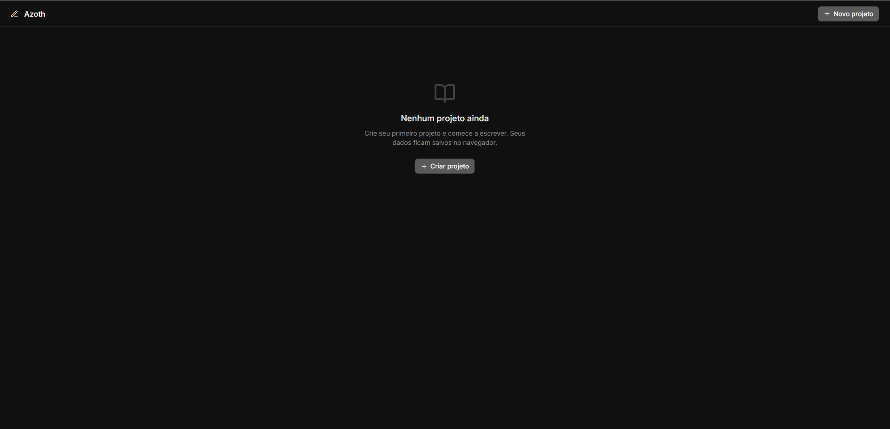

# Azoth -- Plataforma de Escrita Criativa

**Azoth** e um editor de texto local-first para escrita criativa (romances, contos, roteiros). Construido com React 19, TipTap e IndexedDB, ele oferece um ambiente de escrita rico e com funcionamento offline -- seus dados nunca saem do navegador a menos que voce exporte.

<p align="center">
  
</p>

---

## Funcionalidades

- **Editor rich text** baseado em TipTap (ProseMirror) com formatacao completa: negrito, italico, sublinhado, tachado, listas, blocos de codigo, citacoes, tabelas, checklists, imagens e alinhamento
- **Documento unico por projeto** -- sem separacao rigida entre cenas/capitulos como entidades; capitulos sao headings H1 no texto
- **Sumario (TOC) automatico** na barra lateral, extraido dos headings H1, H2 e H3 com navegacao via clique
- **Sinopses de capitulo** -- area de texto colapsavel para resumos por capitulo (H1)
- **Bubble menu** flutuante ao selecionar texto com acoes rapidas (negrito, italico, etc.)
- **Slash menu** -- digite `/` para inserir headings, listas, citacoes e mais
- **Barra de ferramentas flutuante** com auto-hide, grupos de botoes, menu de overflow e seletor de cores (texto e destaque)
- **Busca no documento** com realce (decorations ProseMirror), navegacao anterior/proximo (Ctrl+F)
- **Modo foco** para escrita sem distracoes (Ctrl+Shift+F)
- **Breadcrumb** na barra superior com o heading ativo baseado em scroll
- **Contagem de palavras** em tempo real
- **Auto-save** com debounce de 1,5s e indicador de status (Salvo / Salvando... / Nao salvo)
- **Personagens, Locais e Notas** como paginas auxiliares com CRUD completo
- **Exportacao** do projeto como Markdown (.md) ou texto puro (.txt)
- **Backup e restauracao** de todos os dados em JSON (inclusive para migrar entre navegadores)
- **Atalhos de teclado** para navegacao entre capitulos e busca
- **Code splitting** automatico (TipTap e Lucide em chunks separados)
- **Error boundary** e aviso de beforeunload para dados nao salvos
- **Acessibilidade**: atributos aria, teclado, `prefers-reduced-motion`
- **Tema escuro** Midnight com paleta de cores personalizada

---

## Arquitetura

Azoth e uma aplicacao 100% client-side. Nao ha servidor -- todo o armazenamento ocorre no IndexedDB do navegador via Dexie.

```
[React App]
    |
    |-- [Zustand Stores] (editor, projeto, UI)
    |       |
    |       v
    |-- [Dexie / IndexedDB] (projetos, personagens, locais, notas)
    |
    |-- [TipTap Editor] (ProseMirror)
            |
            |-- StarterKit + Extensions (underline, tables, tasks, etc.)
            |-- CodeBlockLowlight (syntax highlighting)
            |-- Search Plugin (decorations ProseMirror)
            |-- Bubble Menu, Slash Menu, Floating Toolbar
```

**Fluxo de dados:**

1. O usuario digita no editor TipTap
2. A cada alteracao, o conteudo e convertido para JSON (ProseMirror doc)
3. `autoSave()` dispara apos 1,5s de inatividade
4. O JSON e salvo no IndexedDB via Dexie
5. Personagens, locais e notas sao entidades separadas vinculadas ao projeto por `projectId`
6. Headings H1 no documento sao parseados como capitulos para o sumario lateral
7. A exportacao converte o JSON do documento para Markdown ou texto puro

---

## Tecnologias

| Categoria | Tecnologia | Versao |
|---|---|---|
| Linguagem | TypeScript | ~6.0 |
| Framework UI | React | ^19.2 |
| Bundler | Vite | ^8.1 |
| Editor rich text | TipTap (ProseMirror) | ^2.11 |
| Gerenciamento de estado | Zustand | ^5.0 |
| Banco local (IndexedDB) | Dexie | ^4.0 |
| Estilizacao | Tailwind CSS | ^4.1 |
| Animacoes | Motion (Framer Motion) | ^12.10 |
| Icones | Lucide React | ^0.511 |
| Syntax highlight | lowlight | (via TipTap) |
| Linter | Oxlint | ^1.71 |
| Utilitarios | clsx, tailwind-merge, class-variance-authority | -- |

---

## Requisitos

- Node.js 20+ (recomendado 22 LTS)
- npm 10+

---

## Instalacao

```bash
# Clone o repositorio
git clone https://github.com/seu-usuario/writing-studio.git
cd writing-studio

# Instale as dependencias
npm install

# Inicie o servidor de desenvolvimento
npm run dev
```

Acesse `http://localhost:5173` no navegador.

---

## Scripts

| Comando | Descricao |
|---|---|
| `npm run dev` | Inicia o servidor de desenvolvimento Vite |
| `npm run build` | Compila TypeScript e gera build de producao |
| `npm run preview` | Pre-visualiza o build de producao localmente |
| `npm run lint` | Executa o linter Oxlint |

---

## Estrutura do Projeto

```
src/
├── App.tsx                          # Componente raiz com roteamento interno
├── main.tsx                         # Entry point React
├── index.css                        # Estilos globais, design tokens, Tiptap
│
├── components/
│   ├── app-shell.tsx                # Layout principal (topbar + sidebar + conteudo)
│   ├── top-bar.tsx                  # Barra superior com breadcrumb, status, export
│   ├── sidebar.tsx                  # Barra lateral com TOC e navegacao
│   ├── error-boundary.tsx           # Error boundary (captura de erros)
│   │
│   ├── editor/
│   │   ├── editor.tsx               # Componente editor TipTap principal
│   │   ├── bubble-menu.tsx          # Menu flutuante ao selecionar texto
│   │   ├── slash-menu.tsx           # Menu ao digitar "/"
│   │   ├── search-panel.tsx         # Painel de busca no documento
│   │   ├── search-plugin.ts         # Plugin ProseMirror para decorations de busca
│   │   │
│   │   └── floating-toolbar/        # Barra de ferramentas flutuante
│   │       ├── floating-toolbar.tsx  # Componente principal com auto-hide
│   │       ├── toolbar-config.ts    # Definicoes dos botoes e grupos
│   │       ├── toolbar-button.tsx   # Botao individual da toolbar
│   │       ├── toolbar-divider.tsx  # Separador visual
│   │       ├── toolbar-colors.tsx   # Seletor de cores (texto/destaque)
│   │       └── overflow-menu.tsx    # Menu "Mais opcoes"
│   │
│   └── ui/
│       └── button.tsx               # Componente Button reutilizavel
│
├── pages/
│   ├── dashboard.tsx                # Tela inicial: listagem e criacao de projetos
│   ├── characters.tsx               # CRUD de personagens
│   ├── locations.tsx                # CRUD de locais
│   └── notes.tsx                    # CRUD de notas
│
├── stores/
│   ├── editor-store.ts              # Store Zustand: estado do editor
│   ├── project-store.ts             # Store Zustand: projetos
│   └── ui-store.ts                  # Store Zustand: estado da interface
│
├── db/
│   └── index.ts                     # Classe Dexie (IndexedDB) com schema v4
│
├── lib/
│   ├── utils.ts                     # Utilitarios: cn(), generateId(), wordCount(), parseHeadings()
│   ├── export.ts                    # Exportacao para Markdown e TXT
│   └── backup.ts                    # Backup e restauracao em JSON
│
└── types/
    └── index.ts                     # Tipos TypeScript: Project, Chapter, Scene, Character, Location, Note
```

---

## Atalhos de Teclado

| Atalho | Acao |
|---|---|
| `Ctrl+F` | Abrir/fechar busca no documento |
| `Ctrl+Shift+F` | Alternar modo foco |
| `Ctrl+Shift+ArrowDown` | Ir para o proximo heading |
| `Ctrl+Shift+ArrowUp` | Voltar para o heading anterior |
| `Escape` | Fechar busca ou menu suspenso |
| `Shift+Enter` (na busca) | Resultado anterior |
| `Enter` (na busca) | Proximo resultado |
| `Ctrl+Z` | Desfazer |
| `Ctrl+Shift+Z` | Refazer |
| `Ctrl+B` | Negrito |
| `Ctrl+I` | Italico |
| `Ctrl+U` | Sublinhado |

---

## Modelo de Dados

### Project

O documento do projeto e armazenado como JSON (formato ProseMirror) no campo `content`. Capitulos sao definidos por headings H1 dentro desse JSON.

```typescript
interface Project {
  id: string
  title: string
  description: string
  content: object | null          // ProseMirror JSON doc
  chapterSynopses: Record<string, string>  // sinopses por capitulo
  createdAt: string
  updatedAt: string
}
```

### Character, Location, Note

Entidades auxiliares vinculadas ao projeto por `projectId`.

```typescript
interface Character {
  id: string
  projectId: string
  name: string
  description: string
  createdAt: string
  updatedAt: string
}

interface Location {
  id: string
  projectId: string
  name: string
  description: string
  createdAt: string
  updatedAt: string
}

interface Note {
  id: string
  projectId: string
  title: string
  content: string
  createdAt: string
  updatedAt: string
}
```

---

## Exportacao e Backup

### Exportar projeto

- **Markdown** (.md) -- converte o documento ProseMirror para Markdown com headings, listas, codigo, citacoes e links
- **Texto puro** (.txt) -- extrai apenas o texto, sem formatacao

### Backup completo

- **Exportar backup** -- baixa um arquivo JSON com todos os dados do banco (projetos, personagens, locais, notas)
- **Importar backup** -- restaura todos os dados a partir de um JSON previamente exportado (substitui os dados existentes)

---

## Docker

```bash
# Construir a imagem
docker compose build

# Iniciar o servidor
docker compose up

# Acessar em http://localhost:3000
```

---

## Variaveis de Ambiente

Nao ha variaveis de ambiente obrigatorias. O projeto funciona inteiramente no cliente.

O arquivo `compose.yaml` define `NODE_ENV=production` para o container Docker.

---

## Desenvolvimento

### Tecnologias e ferramentas

- **Vite 8** com plugin React e Tailwind CSS v4
- **TypeScript 6** com modo strict e `verbatimModuleSyntax`
- **Oxlint** para linting (sem ESLint/Prettier)
- Path alias `@/` mapeado para `./src/`

### Code Splitting

O Vite esta configurado para separar `@tiptap/*` e `lucide-react` em chunks independentes no build de producao.

Componentes de pagina sao carregados via `React.lazy()` com `Suspense`.

---

## Contribuicao

1. Fork o repositorio
2. Crie uma branch: `git checkout -b minha-feature`
3. Faca suas alteracoes
4. Execute `npm run lint` para verificar o codigo
5. Commit com mensagem descritiva
6. Push para a branch: `git push origin minha-feature`
7. Abra um Pull Request

---

## Licenca

Distribuido sob a licenca MIT. Veja o arquivo `LICENSE` para mais informacoes.

---

## Autor

**Vinicius Dias** -- Designer e desenvolvedor.
